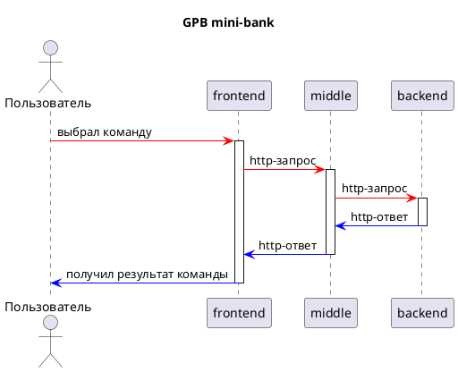

GPB мини-банк 
===

_Мы - один из крупнейших универсальных банков России, приступаем к разработке нового проекта - GPB мини-банк. Наш сервис помогает людям распоряжаться своими деньгами так, как им хочется._

Для получения более точной информации воспользуйтесь навигацией:
- [Наши преимущества](#наши-преимущества)
- [Наш стек](#наш-стек)
- [Как это работает?](#как-это-работает?)
- [Контакты](#контакты)

## Наши преимущества: 

- [x] **надёжность** :lock:
- [x] **безопасность** :cactus:
- [x] **скорость** :horse_racing:

## Наш стек: 

:one: [Java](https://www.java.com/ru/)  
:two: [Spring Boot](https://spring.io/projects/spring-boot)  
:three: [PostgreSQL](https://www.postgresql.org/)  
:four: [Gradle](https://gradle.org/)

## Как это работает? 

Клиент взаимодействует с сервисом через бота, который посылает http-запросы на сервис, который, в свою очередь, будет производить операции и формировать http-ответ. Более точный принцип работы смотри ниже :arrow_down:

**Для любителей серьёзных переговоров и пафоса**:

**Для любителей расслабиться и поюморить (а также чёрных фонов):**

## Контакты: 
По поводу вопросов и предложений обращайтесь :arrow_down:  

:speech_balloon: Telegram: [@dmitkorsh](https://t.me/dmitkorsh)  
:mailbox: Email: <a href="mailto:dashima.1998@mail.ru">dashima.1998@mail.ru</a>
