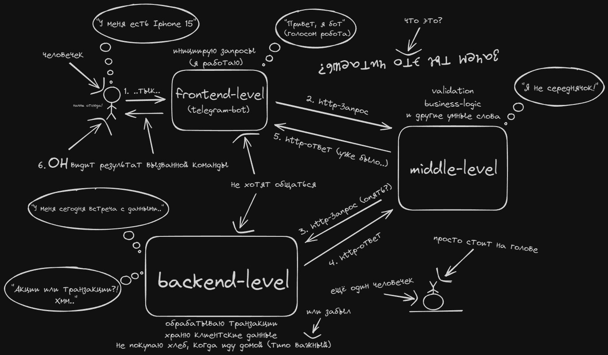

GPB мини-банк 
===

_Наш сервис помогает людям распоряжаться своими деньгами, производить различные банковские операции. Клиент взаимодействует с сервисом через бота, который посылает http-запросы на сервис, который, в свою очередь, будет производить операции и формировать http-ответ.
Приложение находится на стадии разработки, однако мы уверены, 
что с нашим подходом к работе, это будет нечто совершенное._

## Наши преимущества:

- [x] **надёжность** :lock:
- [x] **безопасность** :cactus:
- [x] **скорость** :horse_racing:

## Как это работает?

**Для любителей серьёзных переговоров и пафоса**:

**Для любителей расслабиться и поюморить (а также чёрных фонов):**

